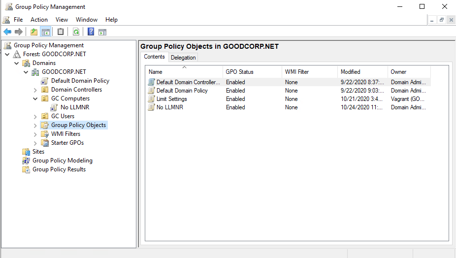
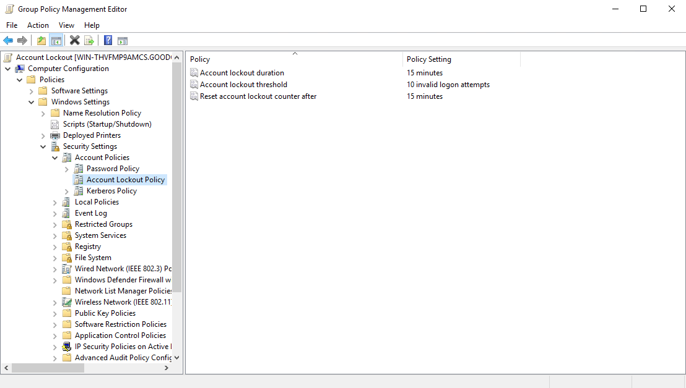
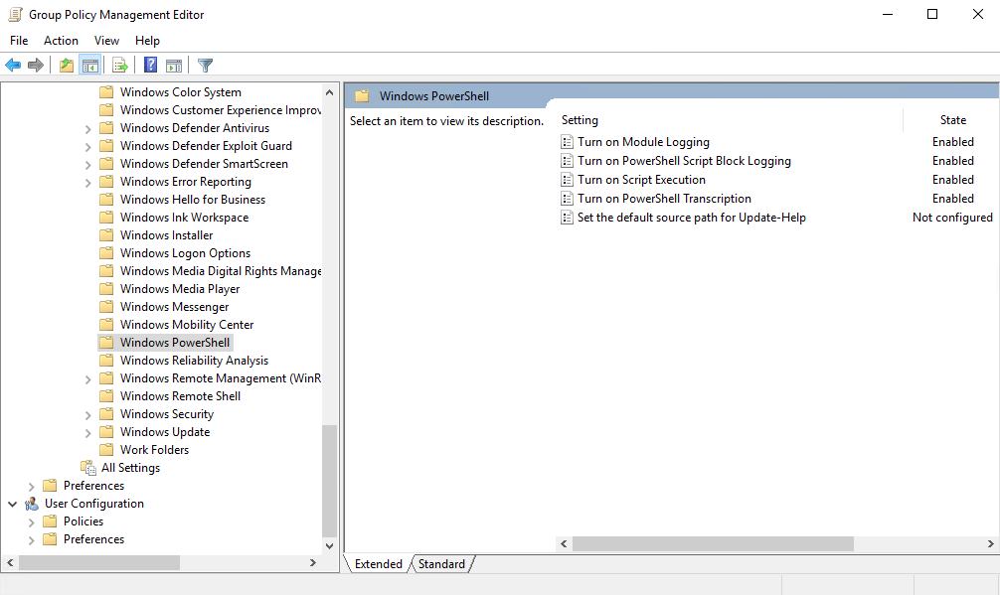
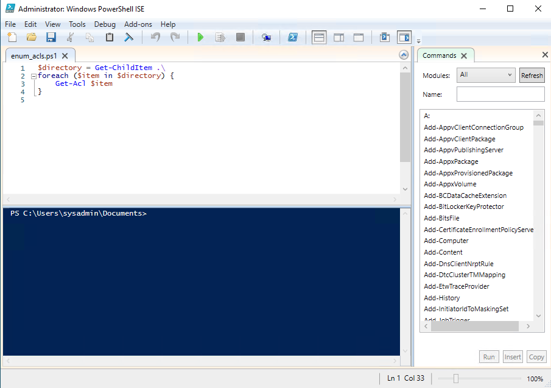
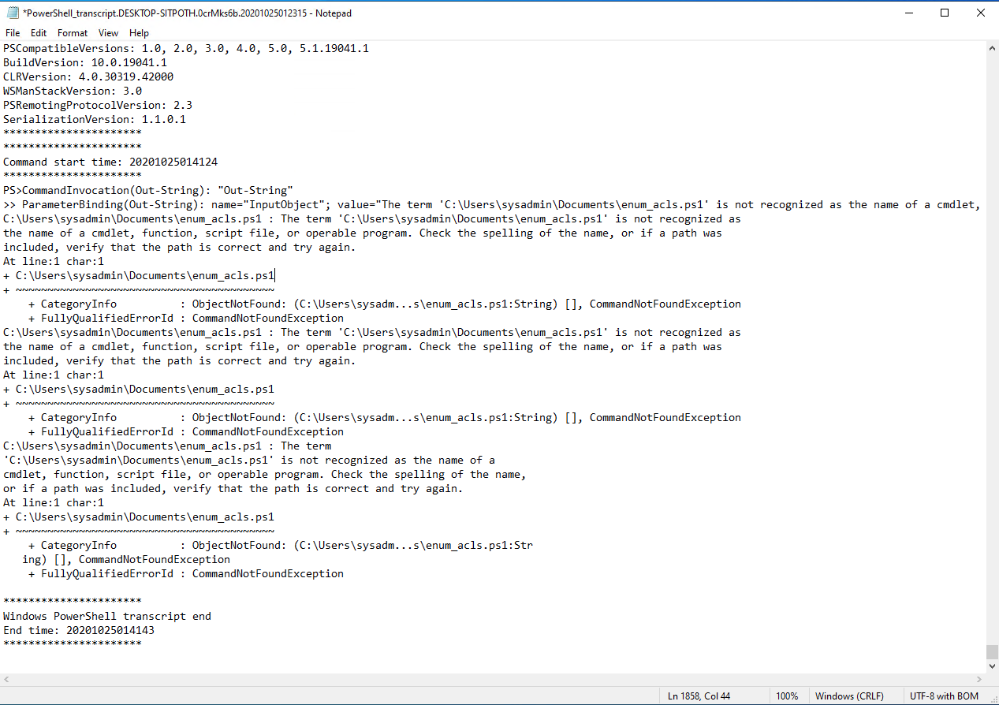

Renato Campos

October 27, 2020

Cybersecurity HW#7

### Submission

- **Deliverable for Task 1:** Take a screenshot of all the GPOs created for this homework assignment. To find these, launch the Group Policy Management tool, select **Group Policy Objects**, and take a screenshot of the GPOs you've created.



- **Deliverable for Task 2:** Submit a screenshot of the different `Account Lockout` policies in Group Policy Management Editor. It should show the three values you set under the Policy and Policy Setting columns.



- **Deliverable for Task 3:** Submit a screenshot of the different `Windows PowerShell` policies within the Group Policy Management Editor. Four of these should be enabled.



- **Deliverable for Task 4:** Submit a copy of your P script.

```powershell
 $directory = Get-ChildItem .\
foreach ($item in $directory) {
    Get-Acl $item
} 
```



- **Deliverable for Bonus Task 5:** Submit a screenshot of the contents of one of your transcribed PowerShell logs or a copy of one of the logs.




