Renato Campos

November 17, 2020

Cybersecurity HW#10

## Cryptography Homework

### Deliverable

- Below you will find screenshots of each riddle solution, the keys generated, and the final proof that the ransomware has been decrypted.

- **Riddle 1 Screenshot:**

**Solution:**  `ozcjmz = gruber`

**Key 1:** `6skd8s` 

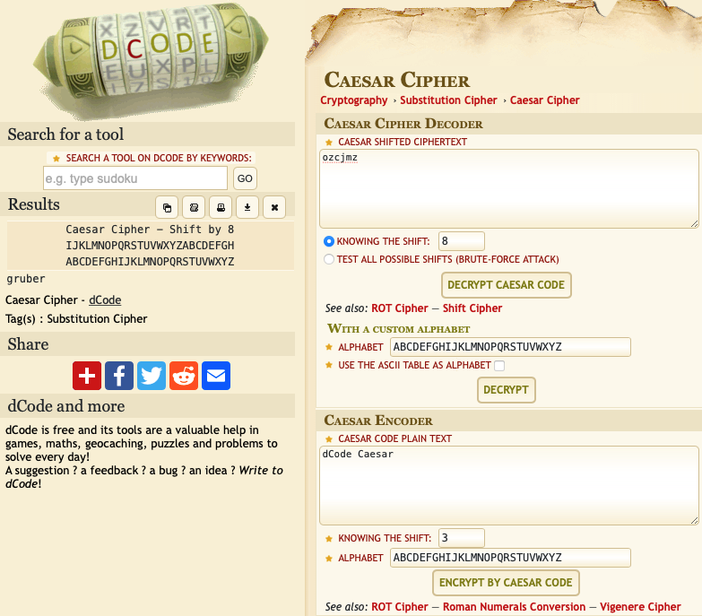

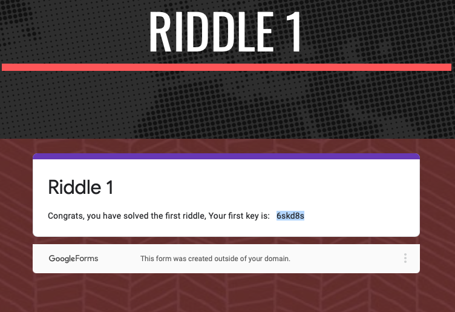

- **Riddle 2 Screenshot:** 

  **Solution:**

  ```
  01000111 01100101 01101110 
  01101110 01100101 01110010        =     Gennero
  01101111
  ```

**Key 2:** `cy8snd2`


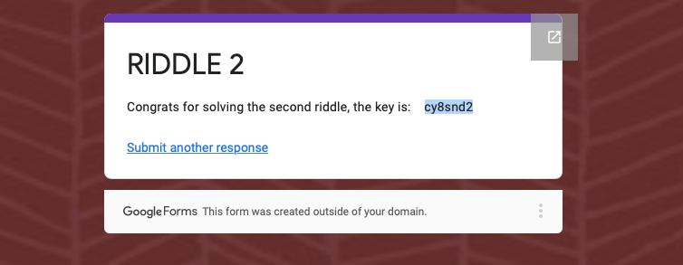

- **Riddle 3 Screenshot:**

**File to hold cipher text:**

```
# riddle3.txt.enc 
4qMOIvwEGXzvkMvRE2bNbg==
```

**Solution:** `4qMOIvwEGXzvkMvRE2bNbg==     =     takagi`

**Key:** `ud6s98n`

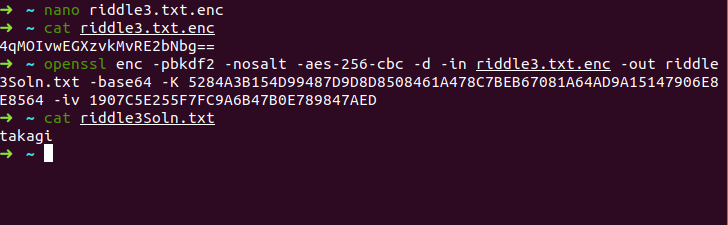

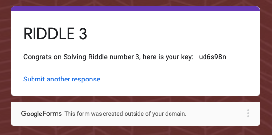

- **Riddle 4 Screenshot:**

  Key: `7gsn3nd2`

  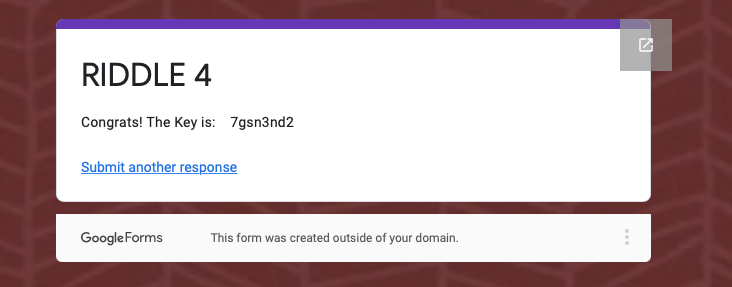

- **Riddle 5 Screenshot:**

  Solution: `3b75cdd826a16f5bba0076690f644dc7  =  argyle`

  **Key:** `ajy39d2`

  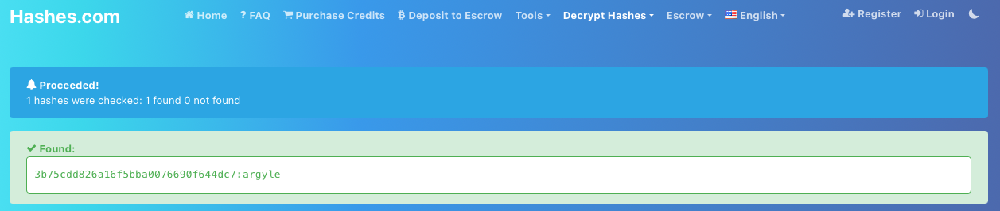

  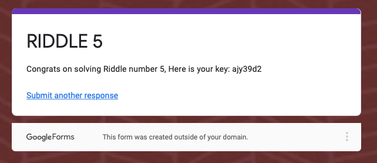

- **Riddle 6 Screenshot:**

  **Solution:** `mcclane`

  **Key:** `7skahd6`

  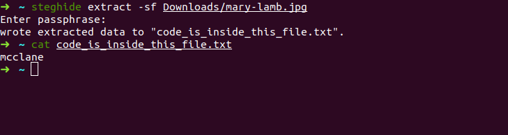
  
  ​	

- **Final Proof:**

  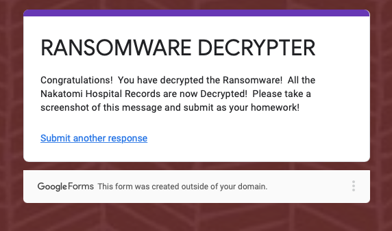

- **Screenshot of personal Azure account, `renato@polymathean.org`:**

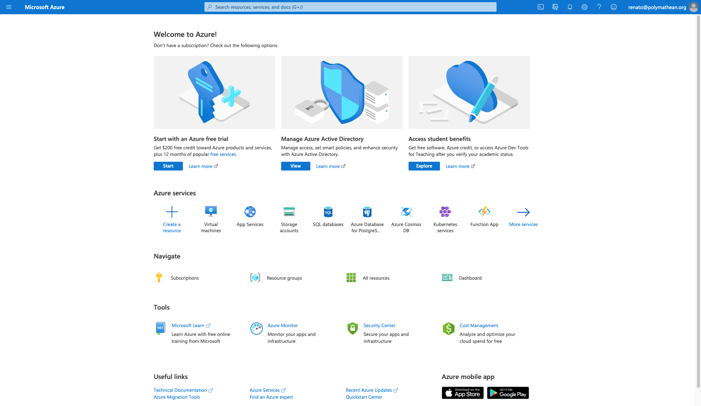

