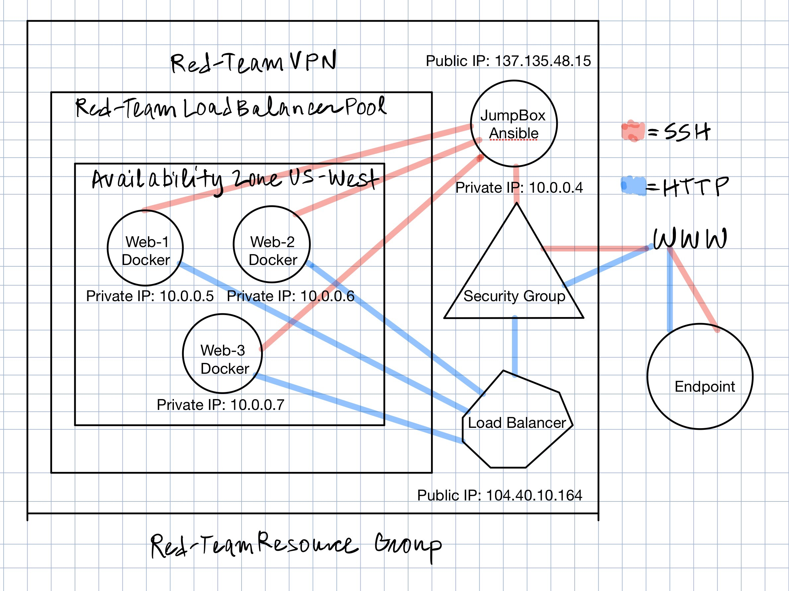

Renato Campos

December 08, 2020

Cybersecurity HW#12

## Submission File: Cloud Security

### Part 1

1. What are 3 common job roles that combine security and cloud skills?
   - **Cloud Architect**
   - **DevSecOps**
   - **Cloud Security Analyst/Pentester**
2. What are the 3 biggest cloud provider platforms?
   - **Amazon Web Services** (Amazon)
   - **Microsoft Azure** (Microsoft)
   - **Google Cloud** (Google)
3. What are the 6 most common cloud services (and their acronyms)?
   - **IaaS**
     - ***Infrastructure as a service.***
     - Pay as you go service for storage, networking, computing.
     - All machines are up to date and ready.
     - Provider-enforced security controls.
     - AWS, Azure, Google Cloud.
   - **PaaS**
     - ***Platform as a service.***
     - Enviroments to build applications.
     - Classroom Labs (Azure).
   - **Saas**
     - ***Software as a service.***
     - Delivers software and applications through the internet.
     - Uses web interfaces and APIs.
     - Office 365, iWork.
   - **DaaS/DBaaS**
     - ***Data/Database as a service.***
     - Provides a company a data product.
     - Database available regardless of location.
     - High availiability and fault tolerance.
   - **CaaS**
     - ***Communications as a service.***
     - Zoom, VOIP.
   - **XaaS**
     - ***Anything as a service.***
4. What is the difference between a virtual network and a physical network?
   - **A virtual network typically will have and enforced secure configuration, secure architecture, higher fault tolerance (meaning it can continue to run if a component is compromised), redundancy, and can be containerized through its settings/configuration.**
5. What is the point of setting your first firewall rule to block _all_ traffic?
   - **To securely monitor and configure only the most necessary communications through adding routes one at a time.**
6. What is the difference between physical computing components (CPU, RAM, HDD/SSD) and virtual computing components? 
   - **Since virtual components are not physical, they can easily be reconfigured, redeployed and more redundant/available through duplication of foundational architecture.**
7. What is the purpose of using an encrypted ssh key to connect to a machine?
   - **To establish a secure, remote connection.**
8. What is the difference between a container and a virtual machine?
   - **Containers are smaller than VMs, take less rsources than a VM, and are easier to destroy and redeploy.**
9. What is a provisioner? Provide 3 examples of common provisioning software.
   - **Provisioners provide automatic configuration of machines, networks, and services. Examples of provisioning software include Docker, Vagrant, and Virtualbox, and AWS EC2.**
10. What is meant by Infrastructure as Code?
    - **Infrastructure as code is the management and provisioning computer data (as hosts, networks, or general services) through machine-readable definition files instead of traditional physical hardware configuration.**
11. What is Continuous Integration/Continuous Deployment?
    - **With regards to application or software development, CI/CD is the idealogy behind a set of practices that motivate development and implementation of small changes from version to version in such a way that development remains consistent and automated through Continuous Integration. From here, Continuous Deployment automates the delivery of applications or software to selected system infrastructures or environments.**
12. What is a VPN and when should we use one?
    - **A VPN is a virtual private network that extends another private network across the public internet and allows clients to send and receive data across the public internet simulating a connected, local client. For this reason, VPNs are useful for remote work as you can have clients log in through some means of authentication to share a protected set of resources and data.**
13. What is the purpose of a load balancer?
    - **To manage the flow of network packets so that one particular server or service is not overloaded.**
14. What is a resource group in Azure?
    - **A form of categorization for grouping together services under Azure to share network settings, data, or security configurations.**
15. What is Region in Azure?
    - **The geographic location of where the servers hosting a service are.**

### Part 2
### 

### Part 3

Please see the PDF, ***Threat Modeling Mock Report***, located in the same directory as this file.
