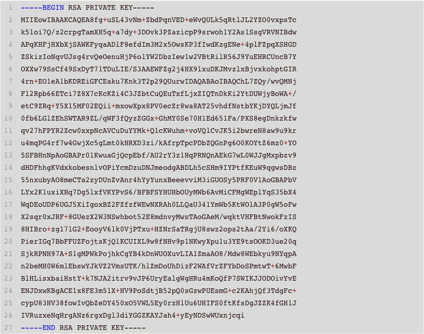
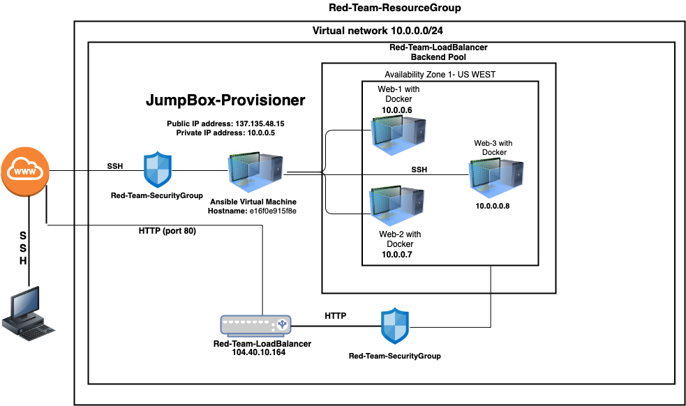
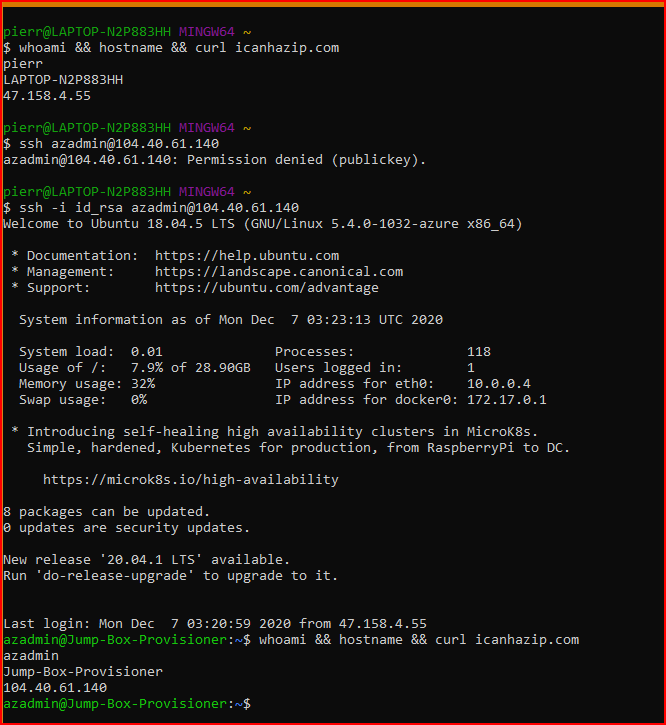
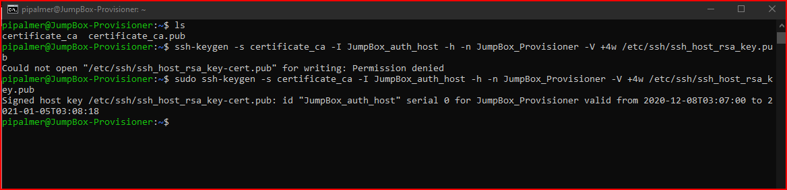
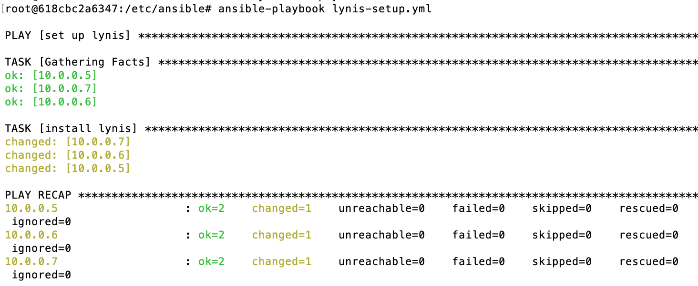
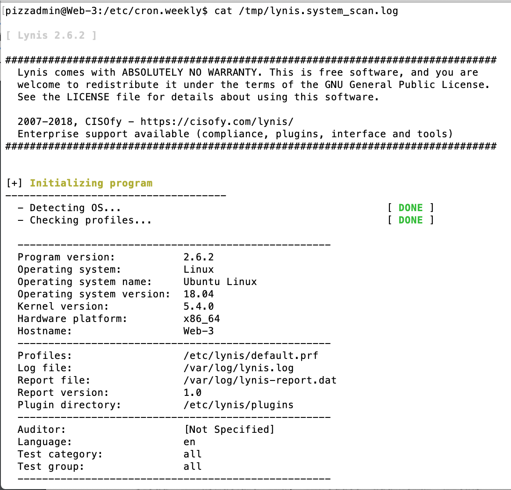
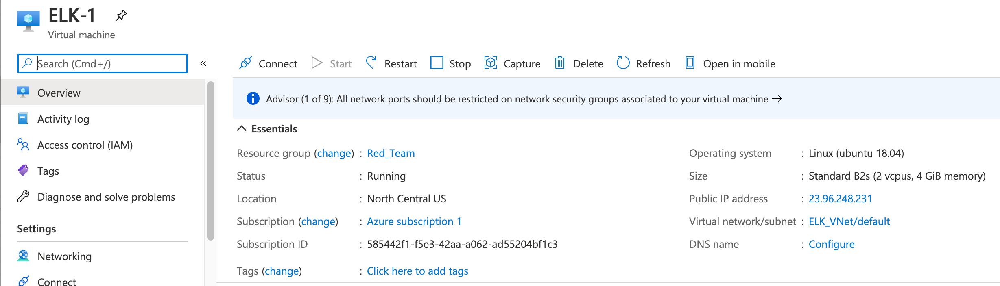

# Threat Modeling Mock Report

## Authors

- Chadwick Spencer
- Eric Sexton
- Kea White
- Pierre Palmer
- Renato Campos
- Thomas Alexander

## Table of Contents

[toc]

## Introduction & Objective

- This report outlines and describes the potential risks and threat agents that would compromise a network, as well as showing how common each vulnerability is. Our team created a virtual private network to demonstrate within a controlled lab environment, on how to mitigate each risk that can jeopardize a user. The threats chosen to cover are DDoS, Unprotected/ Weak SSH, and outdated or unpatched software/operating systems. The mitigations used for each risk were: Cloudfare Comprehensive DDoS Protection, multi-factor authentication, the use of Lynis to audit the Web VMs, utilizing SELinux, and using certificates alongside SSH keys.

## Assesment Scope

- **Azure Cloud Platform**

  - Subscription ID: `ec96a93b-061a-41f5-a43f-27ca13475d66`

- **Resource Group**

  - Name: `Red-Team-ResourceGroup`

- **Network Security Group**

  - Name: `Red-Team-SecurityGroup`
  - **Inbound Rules:**

  | Priority | Name              | Port | Protocol | Source            | Destination    | Action |
  | -------- | ----------------- | ---- | -------- | ----------------- | -------------- | ------ |
  | 4000     | AllowRemote-SSH   | 22   | Any      | 78.215.163.192    | 10.0.0.4       | Allow  |
  | 4003     | AllowRemote-HTTP  | 80   | Any      | 78.215.163.192    | Any            | Allow  |
  | 4005     | AllowJBox-SHH     | 22   | Any      | 10.0.0.4          | VirtualNetwork | Allow  |
  | 65000    | AllowVNet-Any     | Any  | Any      | VirtualNetwork    | VirtualNetwork | Allow  |
  | 65001    | AllowsLoadBal-Any | Any  | Any      | AzureLoadBalander | Any            | Allow  |
  | 65500    | DenyAllInbound    | Any  | Any      | Any               | Any            | Deny   |

  - **Outbound Rules:**

  | Priority | Name                  | Port | Protocol | Source         | Destination    | Action |
  | -------- | --------------------- | ---- | -------- | -------------- | -------------- | ------ |
  | 65000    | AllowVNetOutbound     | Any  | Any      | VirtualNetwork | VirtualNetwork | Allow  |
  | 65001    | AllowInternetOutbound | Any  | Any      | Any            | Internet       | Allow  |
  | 65500    | DenyAllOutbound       | Any  | Any      | Any            | Any            | Deny   |

- **VPNs**

  - Read-Team-VPN (*VirtualNetwork*)

    ​			<u>**Subnet Mask**</u>

    - Addresses: `256`
    - Hosts: `254`
    - Netmask: `255.255.255.0`
    - Amount of a Class C: `1`


- **SSH-Keys**

- JumpBox-Provisoner (*SSH Public Key 1*): 

  ```bash
  ssh-rsa AAAAB3NzaC1yc2EAAAADAQABAAACAQCzGMIgvSJc4x5o+X+gMTXRlOvnbQTx8zQ2KXZfXrCHRS/6+pJH61wpWMSi0O0Uub83POyzoTHt2gdukL9k5WCG8NLrz14DboZuIxBoHgleG1Ndl4mKFH8btYo/7/urcbjw4e5EYDIObLgDOP7Fs2Mnjq0LKIRUiipCwD/4gSrPRg8tk9D+JlMzgaBvCgNLS8HgdlvpvqrZLi0foJd1AO2VJSpNa/36d/sIVeaGJlOJ8GeQPEjb+1ehKEaFqWjbdWs3pJC7f8DWO5uYD6lJPAWfnnhPJw9eU22XT6juMLW3hyj9M2WQZ/lsatqlRSUEgl35yZRU2YA0KRVNUwMdQVevOdoLHxePa4gZ7dKikphU8UaOY7IVwvlf3T52OcFTzZ9tA2+R/vkZ9/cpXLjDg+Z0yiUKPYRpgrm9FZdrjB2TTgHucUWpeAxS/e7dS6Dz9njuMQmjt7XPxaAP02tkQbM0fP6N14HWfbAZxSrhkB3nvmF/kni3X4kwZMigHWgLpEQ62dcrGxjCvWF4WeKYsoW0bhE0hnfj+xHv+Nvk3+xrzlbm58LyRwDQBDM7o+pyEEfE7g3sHQ6bzOPaFklGhc+XJpFpNxVk2IJ9m5u35OI9yrE7NiB1ht1qiYNuJZiDrnW4TA2Ti0CMtnzZNFtJGovtDIYdHkWhl2KvPGSSr/uXUQ==
  ```


  - Ansible Docker Container (*SSH Public Key 2*): 

    ```bash
    ssh-rsa AAAAB3NzaC1yc2EAAAADAQABAAABAQDx+D65Ivje82b5lt0+qdUQP55a9BQuTmpG2UkvZhk7S/GmxNyTnWiLtD/PZyumBNqZcfmr5rt3L7cM6+Tc9lrOJyk/2yvCiHVjYCzVKyBVFU0gF3AA+oocWMddteNIBYoXKpoAOUXx590ibczbHk7Cwo/d8jB0rOAQ177imUVmmpdIcYNlKSLMig2q9QmyDiu9B456e4eM/qiVhbYNvMh7DXDZUG1GKVHnon1i4QdEJSdwHtg5dfDv1KwJ/j1LEPJPvVMO4sgT9LcAARYVmDaPgdf2XG4Moky/OXEGO/GSiGm0YhHiuf4Q7V4DVsoNESIYUIRqS7sqeTdPanb1BS6v root@e16f0e915f8e
    ```


- Ansible Docker Container (*SSH Private Key 2*): 




**Virtual Machines**

|                     | Jumpbox-Provisoner     | Web-1            | web-2            | web-3            |
| ------------------- | ---------------------- | ---------------- | ---------------- | ---------------- |
| Internal IP Address | 10.0.0.5               | 10.0.0.6         | 10.0.0.7         | 10.0.0.8         |
| External IP Address | 137.135.48.15          | -                | -                | -                |
| Availiability Zone  | US-West                | US-West          | US-West          | US-West          |
| Operating System    | Ubuntu <br />18.04 LTS | Ubuntu 18.04 LTS | Ubuntu 18.04 LTS | Ubuntu 18.04 LTS |
| Username            | azadmin                | azadmin          | azadmin          | azadmin          |
| Password            | -                      | -                | -                | -                |
| SSH Key             | SSH Key 1              | SSH Key 2        | SSH Key 2        | SSH Key 2        |
| Enabled Services    | Docker                 | Docker           | Docker           | Docker           |
| vCPUs               | 1                      | 1                | 1                | 1                |
| RAM                 | 1 GB                   | 2 GB             | 2 GB             | 2 GB             |

- **Load Balancer**
  - Name: Red-Team-LoadBalancer (*AzureLoadBalancer*)
  - Public IP Address: `104.40.10.164`
  - Backend Pool Machines: 
    - **Web-1**
    - **Web-2**
    - **Web-3**
  
  - Health Probes:
    - **Name:** Red-Team-HealthProbe
    - **Protocol:** TCP
    - **Port:** 80
    - **Used By:** Red-Team-LBalanceRule


- **Public Endpoints** (Remote Endpoint Machines)
  - There is at least one endpoint machine on an external network with public IP address 78.215.163.192.
  - This machine has an unknown private key that was generated concurrently with a public key (stored at one point as an SSH password on the JumpBox-Provisioner VM) that allows administrative access to the terminal on the JumpBox-Provisioner, and thus access to the local Ansible VM.

## Network Diagram




## Threat Agents

- Public SSH keys which have access to Jumpbox-Provisioner have been generated and stored on remote endpoint machines.
- Since these endpoints exist on unmanaged external networks, there is no way to prevent a breach of that endpoint, which will contain configuration files listing the private SSH key used to connect to JumpBox-Provisioner.
- A threat actor with *any* device on the unmanaged external network can use `nmap` to scan the Load Balancer.
- Unsecure software can lead to a breach with minimal effort. By using older software versions, the system is opened to known compromises and vulnerabilities previously discovered. 
-  Vulnerabilities in these key software programs could result in minor system errors (such as the DoS vulnerability) to full system take-overs with root privileges (Non-root users could execute code as root), based on the particular software version.
- Without proper traffic analysis, the provided network could be susceptible to packet flooding (DDoS, Denial of Service). Due to the limited security monitoring of the anomalous traffic, it would not be detected by the load balancer and could result in a full loss of network activity.
- Since the Azure Cloud Platform is accessible from any endpoint with access to the internet, complete access can be attained with an account ID (or email) and password. Additionally, there is a *Remember Me* option for a session when logging in that has been enabled, removing the requirement of entering a password should the session timeout.

## Potential Attacks

- **Threat 1:** DDoS (Denial of Service)

  - If a threat actor gains access to virtual machines Web-1, Web-2, and Web-3 they could be employed in a Denial of Service (DoS) or a Distributed Denial of Service (DDoS) attack against other networks or they could become targets of a DoS or DDoS. Incorporation in a DoS or a DDoS would see the virtual machines used to perform buffer overflow attacks, ICMP flooding, or SYN flooding, rendering the target unfunctional. These machines could also experience the same attack rendering them unusable.


- **Threat 2:** Unprotected/Weak SSH
  
  - User within the endpoint's external network can assess the Load Balancer's ports and server information.
  
  - If outdated, the threat actor can research potential unpatched vulnerabilities.
  
  - It could be possible for the SSH keys in the Ansible container in the Jump Box Provisioner to become compromised, allowing access to the private keys and subsequent access to services using those keys. The SSH keys are not password or certificate protected and once an attacker is in the system it would be possible to gain these credentials and pose as the original user to gain access where connections have been made previously and to set up new connections as the user. This would prevent repudiation, with any actions performed with these credentials being in the name of the user.
  
    **<u>Proof of Concept:</u>**
  
    


- **Threat 3:** Poor System Management
- There is minimal system management within the Azure cloud infrastructure. There are no security auditing tools on the virtual machines, and updates have not been automated. Additionally, there is no system in place to monitor network activity. Lack of visibility can lead to attacks/breaches going undetected and failing to keep the system up-to-date at all times will increase the vulnerability of the network.

## Common Vulnerability Scoring & Risk Priority

|          | Vect. | Comp. | Priv. | Inter. | Scope | Confid. | Integ. | Avail. | Score   |
| -------- | ----- | ----- | ----- | ------ | ----- | ------- | ------ | ------ | ------- |
| Threat 1 | NT    | L     | L     | N      | C     | N       | N      | H      | **7.7** |
| Threat 2 | NT    | L     | H     | N      | C     | H       | H      | H      | **8.2** |
| Threat 3 | NT    | L     | N     | N      | U     | N       | N      | L      | **5.3** |

**Calculated with:** https://www.first.org/cvss/calculator/3.0

- **Category Key:**
  - **VECT** = *Attack Vector*
  - **COMP** = *Attack Complexity*
  - **PRIV** = *Privileges Required*
  - **INTER** = *User Interaction*
  - **SCOPE** = *Scope*
  - **CONFID** = *Confidentiality*
  - **INTEG** = *Integrity*
  - **AVAIL** = *Availability* 
- **Value Key:**
  - **NT** = *Network*
  - **A** = *Adjacent*
  - **LO** = *Local*
  - **P** = *Physical*
  - **N** = *None*
  - **L** = *Low*
  - **H** = *High*
  - **R** = *Required*
  - **U** = *Unchanged*
  - **C** = *Changed*
- **Attack Vector Strings:**
  - **Threat 1:** `CVSS:3.0/AV:N/AC:L/PR:L/UI:N/S:C/C:N/I:N/A:H`
  - **Threat 2:** `CVSS:3.0/AV:L/AC:L/PR:H/UI:N/S:C/C:H/I:H/A:H`
  - **Threat 3:** `CVSS:3.0/AV:N/AC:L/PR:N/UI:N/S:U/C:N/I:N/A:L`

## Mitigations

- Cloudfare Comprehensive DDoS Protection.

  - **Info:** Cloudfare offers DDoSAAS (or DDoS Protection as a Service) that is capable of securing the Web VMs and their Docker containers while also rerouting illegitimate, malicous traffic that could potentetially overload the Load Balancer.
  - **Link:** https://dash.cloudflare.com/sign-up

- Using certificates in conjunction with SSH keys.

  - **Info:** Utilizing certificates (Certificate Authority) reduces a variety of weaknesses from ssh-keys including managing issues with an abundance of keys to sort through. Create a certificate authority on a trusted server by making a private key using `ssh-keygen` with the `-f CA` option. Creating a private key will verify and sign host and user keys for login. The authentication login will exchange certificates instead of keys, making the CA's public key valid. Using this certificate flow allows the benefits of allowing expiration dates to disable a certificate key to gain access. Factors utilizing certificates authentication factor allows for the creation of an expiration date utilization.

  - **Generate Key & Certificate Command:** `ssh-keygen -f CA`

  - **Sign Host Keys and Create Certificates:** 

    `ssh-keygen -h -s CA -n LIST-OF-PRINCIPALS -I ID -V +4w KEYFILE.pub`

  - **Explanation:** 

    - **`-s`**: This is the private key that we just created that we will use to sign all of the other keys.
    - **`-I`**: This is a name that is used to identify the certificate. It is used for logging purposes when the certificate is used for authentication.
    - **`-h`**: This marks the resulting certificate as a host key, as opposed to a client key.
    - **`-n`**: This is used to identify the name (user or host) that is associated with this certificate.
    - **`-V`**: This specifies how long the certificate is valid for. In this instance, we specify that the certificate will expire in 4 weeks.

  

  

  

  

  - **Example:**

    

    

- Multifactor identification for the Azure Cloud Platform.

  - Multifactor identification is the process of registering multiple devices for a user to authenticate access. Secure access to the Azure Web Portal by using multifactor identification and disable the *Remember Me* option.

- Use **SELinux** to define access controls for applications, processes, and files on the system.

  - **Info:** SELinux is a Linux kernal security module for Linux systems that is compatible with Ubuntu 18.04 LTS that allows administration over system access. Access controls are defined for applications, processes, and files alongside with security policies that enforce predefined access.

  - **Install Command:** `sudo apt install selinux`

  - **Enforcing Command:** `sudo sed -i 's/SELINUX=.*/SELINUX=enforcing/' /etc/selinux/config`

  - **Permissive Command:** `sudo sed -i 's/SELINUX=.*/SELINUX=permissive/' /etc/selinux/config`

  - **Note:** Be sure to reboot the machine within Azure for changes to take effect.

  - **Install `lynis` (security tool that performs health scans on the system) on VMs:**

    ```bash
    #lynis-setup.yml
    #Ansible playbook that will install lynis on the Web VMs
    ---
    
    - name: set up lynis
      hosts: webservers
      become: true
      tasks:
    
      - name: install lynis                
        command: apt -y install lynis
    
    ```

  - **Successful Play Example:** 

    

  - **Use Lynis to audit** `JumpBox-Provisioner`, `Web-1`, `Web-2`, `Web-3` .

    - **Info:** Lynis is a security audit tool for Linux systems that is compatible with Ubuntu 18.04 LTS which scans systems and their security defense for the purposes of system hardening. Lynis will provide a report that offers suggestions to better secure the system.

  - **Automate Lynis scans as well as updates with `apt`:**

    - Aptitude Update Script:

      ```bash
      #update.sh
      #shell script that will keep system up-to-date
      
      #!/bin/bash
      
      sudo apt update -y && sudo apt upgrade -y && sudo apt full-upgrade -y && sudo apt-get autoremove --purge -y
      
      ```

    - Lynis Scan Script:

      ```bash
      #lynis-scan.sh
      #shell script that will save a full system lynis audit to a log file in /tmp
      #!/bin/bash
      
      
      sudo lynis audit system >> /tmp/lynis.system_scan.log
      
      ```

    - Cron YAML Setup:

      ```yaml
      #cron-setup.yml
      #Ansible playbook that will copy the update.sh and lynis-scan.sh to /etc/cron.weekly so that the report and updates will be carried automatically on a weekly basis
      ---
      
      - name: set up cron jobs for lynis scans and apt update
        hosts: webservers
        become: true
        tasks:
      
        - name: drop in lynis script
          copy:
             src: /etc/ansible/scripts/lynis-scan.sh
             dest: /etc/cron.weekly
             mode: a+x
      
        - name: drop in update script
          copy:
             src: /etc/ansible/scripts/update.sh
             dest: /etc/cron.weekly
             mode: a+x
      
      ```

  

  

  

  

  

  

  

  

  

  

  

  - **Successful Lynis Scan Example:**

    


- Set up and deploy an ELK stack in order to monitor and analyze network activity.
  - **ELK YAML Configuration:**

```yaml
elk-config.yml
#Ansible playbook that configures our ELK server VM
---

- name: configures ELK VM with docker
  hosts: elk
  become: true
  tasks:

  - name: increase virutal memory
    command: sysctl -w vm.max_map_count=262144

  - name: use more memory
    sysctl:
      name: vm.max_map_count
      value: '262144'
      state: present
      reload: yes

  - name: install packages
    apt:
      name: ['docker.io', 'python3-pip']
      state: present
      force_apt_get: yes
      update_cache: yes

  - name: install docker
    pip:
      name: docker
      state: present

  - name: download/launch a docker elk container
    docker_container:
      name: elk
      image: sebp/elk:761
      state: started
      restart_policy: always
      published_ports:
        - 5601:5601
        - 9200:9200
        - 5044:5044


```

- **ELK server VM properties overview:**

  

  

  Allowing access from the same trusted external network to the Kibana web page in order to view ELK stack network analysis.

  

  

​									