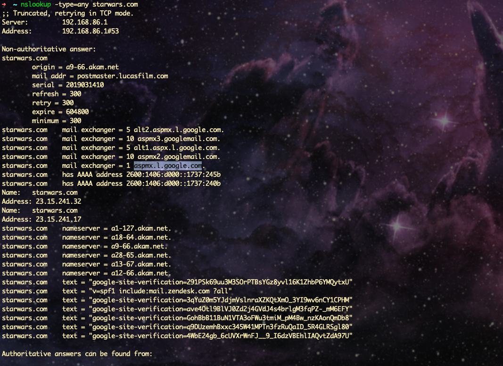
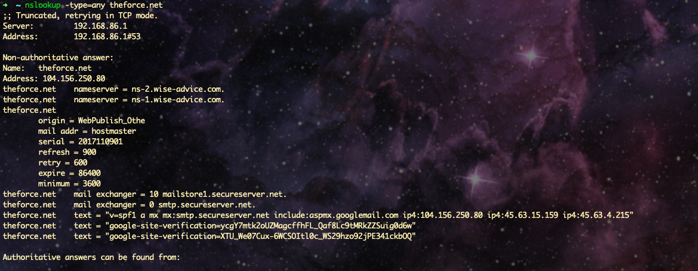
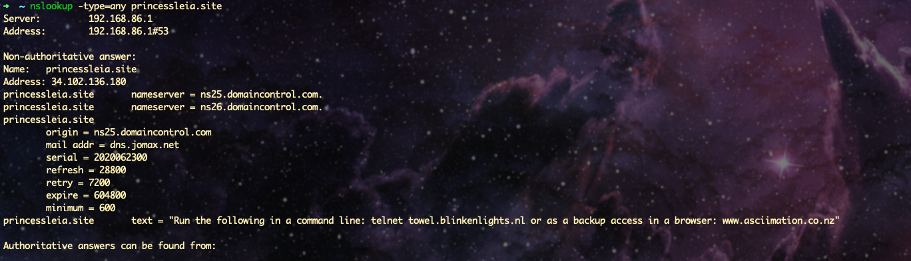
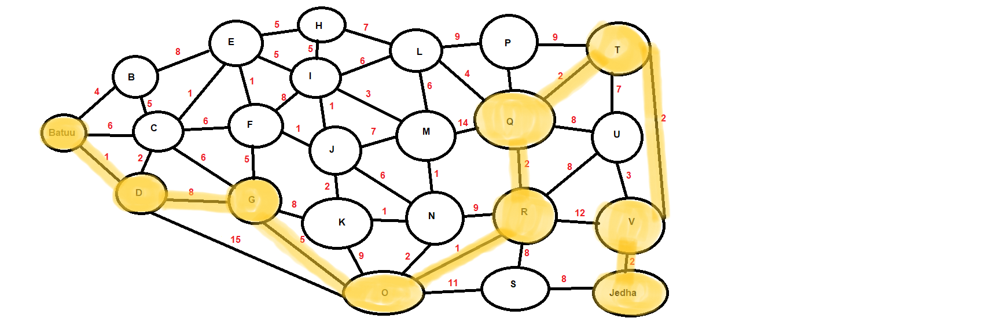
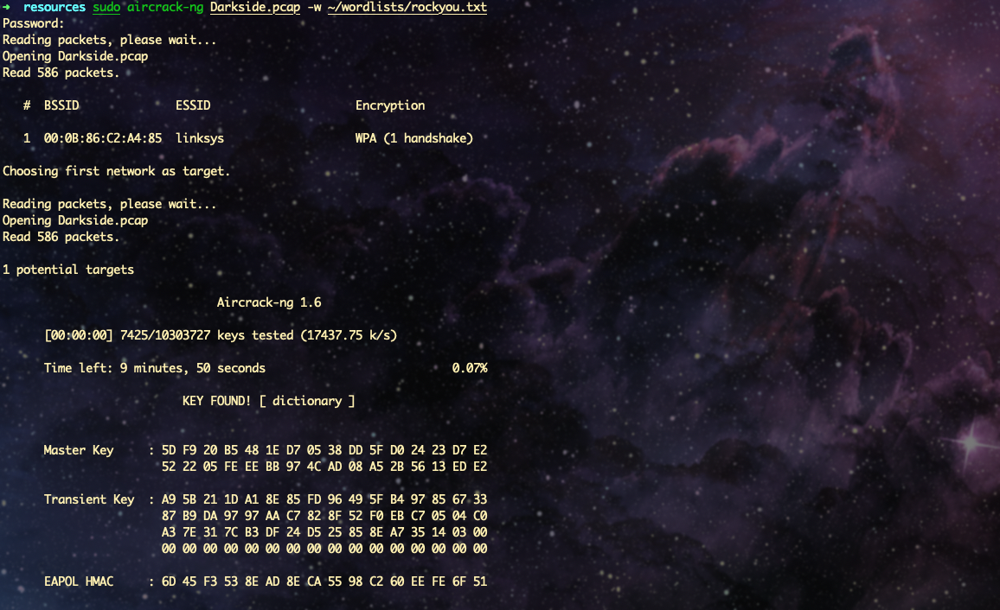
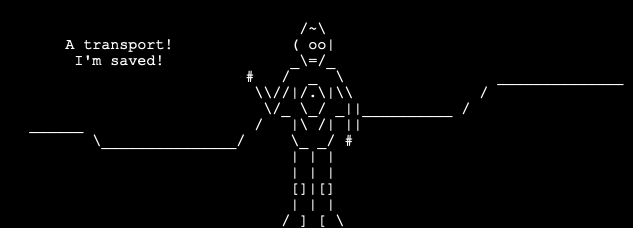
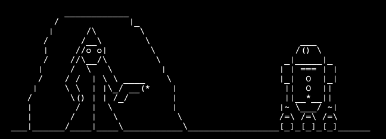

Renato Campos

November 10, 2020

Cybersecurity HW#9

## Networks Fundamentals II Homework

### Mission 1

**Issue**: The Resistance (starwars.com) is able to send emails but unable to receive any.

- The Resistance isn't receiving any emails because they are using incorrect mail server addresses.

  - **Primary Mail Server:** address has been set to `asltx.l.google.com`, but should actually be `aspmx.l.google.com`.
  - **Secondary Mail Server:** address has been set to `asltx.2.google.com`, but should actually be `alt2.aspmx.l.google.com`.

- **Evidence:**



### Mission 2

**Issue**: Many of the alert bulletins are being blocked or going into spam folders.

- This is probably due to the fact that `theforce.net` changed the IP address of their mail server to `45.23.176.21` .


  - `SPF` for `theforce.net` : 

      ```
      v=spf1 a mx mx:smtp.secureserver.net include:aspmx.googlemail.com ip4:104.156.250.80 ip4:45.63.15.159 ip4:45.63.4.215
      ```

  - The Force's emails are going to spam because the IP address selected for their mail server is not one of the trusted, secure server IPs listed in the `SPF` entry for `theforce.net` .

  - The correct IP address of the mail server should be `104.156.250.80`. (Registered secured server.)

  - **Note:** There are actually three choices for working IPs that can be used for the mail server:
      
      - `104.156.250.80`
      - `45.63.15.159`
      - `45.63.4.215`
      
  - **Evidence:**



### Mission 3

**Issue**: The Resistance is unable to easily read the details of alert bulletins online. The Resistance is supposed to be automatically redirected from their sub page of `resistance.theforce.net`  to `theforce.net`.

  - The sub page of `resistance.theforce.net` isn't redirecting to `theforce.net` because it is using an incorrert CNAME, `theforce.net`.
  - **Corrected DNS record:** `www.theforce.net`
  - **Evidence:**


### Mission 4

**Issue**: The Empire taken down the primary DNS server of `princessleia.site`. 

- The DNS server for `princessleia.site` is backed up and functioning. 
- The Resistance is unable to access this important site during the attacks.
- The Resistance's networking team has provided the backup DNS server of: `ns2.galaxybackup.com`.

    - Instead of using the DNS server `ns2.galaxybackup.com`, the Resistance should be using either `ns25.domaincontrol.com` or `ns26.domaincontrol.com` .
- **Evidence:**



### Mission 5

**Issue**: The network traffic from the planet of `Batuu` to the planet of  `Jedha` is very slow.  

- Avoiding planet `N`, the shortest path (or  `OSPF`)  from Batuu to Jedha is:

  -  `Batuu` --> `D` --> `G` --> `O` --> `R` --> `Q` --> `T` --> `V` --> `Jedda` 
  - **Total Time Count:** `23`

  
### Mission 6

**Issue:** Due to all the attacks, the Resistance is determined to seek revenge for the damage the Empire has caused. 

- Below you will find secret information from the Dark Side network servers that can be used to launch network attacks against the Empire.


- Dark Side's secret wireless key: `dictionary`

  

| Network Table   | Device 1          | Device 2          |
| --------------- | ----------------- | ----------------- |
| **IP Address**  | 172.16.0.101      | 172.16.0.1        |
| **MAC Address** | 00:0f:66:e3:e4:01 | 00:13:ce:55:98:ef |


### Mission 7 

*Message received!*

**Evidence:**





