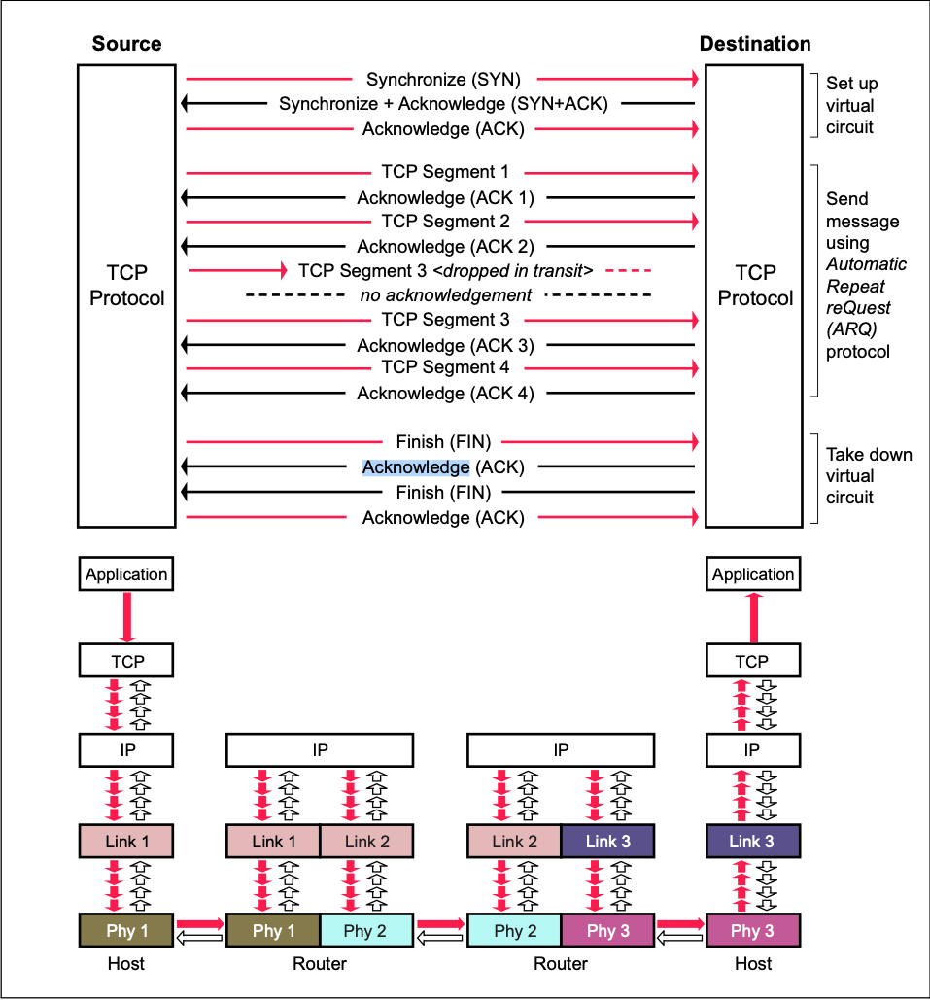

# Bootcamp PPT#24
## Session 9.1 Networking Fundamentals & CTF I
**Thursday October 29, 2020** / 6:30-9:30 PM
**Zoom Link:** https://zoom.us/j/2246200754 
**Zoom Password:** 606132

### Expectations

- Understand DHCP and NAT.
- Analyze packet captures for potential DHCP issues.
- Optimizing network route schemes.

### TCP Handshake Diagram

### DHCP definition

DHCP stands for dynamic host configuration protocol and is a network protocol used on IP networks where a DHCP server automatically assigns an IP address and other information to each host on the network so they can communicate efficiently with other endpoints.

In addition to the IP address, DHCP also assigns the subnet mask, default gateway address, domain name server (DNS) address and other pertinent configuration parameters. Request for comments (RFC) 2131 and 2132 define DHCP as an Internet Engineering Task Force (IETF)- defined standard based on the BOOTP protocol.

### DHCP Steps

1. DHCP Discovery --> `dhcp.option.dhcp == 1`

2. DHCP Offer <-- `dhcp.option.dhcp == 2`

3. DHCP Request --> `dhcp.option.dhcp == 3` / DHCP decline `dhcp.option.dhcp == 4`

4. DHCP Acknowedge <-- `dhcp.option.dhcp == 5`

   

### DHCP simplifies IP address management

The primary reason DHCP is needed is to simplify the management of IP addresses on networks. No two hosts can have the same IP address, and configuring them manually will likely lead to errors. Even on small networks manually assigning IP addresses can be confusing, particularly with mobile devices that require IP addresses on a non-permanent basis. Also, most users aren’t technically proficient enough to locate the IP address information on a computer and assign it. Automating this process makes life easier for users and the network administrator.

### Components of DHCP

When working with DHCP, it’s important to understand all of the components. Below is a list of them and what they do:

- DHCP server: A networked device running the DCHP service that holds IP addresses and related configuration information. This is most typically a server or a router but could be anything that acts as a host, such as an SD-WAN appliance.
- DHCP client: The endpoint that receives configuration information from a DHCP server. This can be a computer, mobile device, IoT endpoint or anything else that requires connectivity to the network. Most are configured to receive DHCP information by default.
- IP address pool: The range of addresses that are available to DHCP clients. Addresses are typically handed out sequentially from lowest to highest.
- Subnet: IP networks can be partitioned into segments known as subnets. Subnets help keep networks manageable.
- Lease: The length of time for which a DHCP client holds the IP address information. When a lease expires, the client must renew it.
- DHCP relay: A router or host that listens for client messages being broadcast on that network and then forwards them to a configured server. The server then sends responses back to the relay agent that passes them along to the client. This can be used to centralize DHCP servers instead of having a server on each subnet.

### Benefits of DHCP servers

In addition to simplified management, the use of a DHCP server provides other benefits. These include:

- Accurate IP configuration: The IP address configuration parameters must be exact and when dealing with inputs such as “192.168.159.3”, it’s easy to make a mistake. Typographical errors are typically very difficult to troubleshoot and the use of a DHCP server minimizes that risk.
- Reduced IP address conflicts: Each connected device must have an IP address. However, each address can only be used once and a duplicate address will result in a conflict where one or both of the devices cannot be connected. This can happen when addresses are assigned manually, particularly when there are a large number of endpoints that only connect periodically, such as mobile devices. The use of DHCP ensures that each address is only used once.
- Automation of IP address administration: Without DHCP, network administrators would need to assign and revoke addresses manually. Keeping track of which device has what address can be an exercise in futility as it’s nearly impossible to understand when devices require access to the network and when they leave. DHCP allows this to be automated and centralized so network professionals can manage all locations from a single location.
- Efficient change management: The use of DHCP makes it very simple to change addresses, scopes or endpoints. For example, an organization may want to change its IP addressing scheme from one range to another. The DHCP server is configured with the new information and the information will be propagated to the new endpoints. Similarly, if a network device is upgraded and replaced, no network configuration is required.

### DHCP poses security risks  

**The DHCP protocol requires no authentication so any client can join a network quickly.** Because of this, it opens up a number of security risks, including unauthorized servers handing out bad information to clients, unauthorized clients being given IP addresses and IP address depletion from unauthorized or malicious clients.

**Since the client has no way of validating the authenticity of a DHCP server, rouge ones can be used to provide incorrect network information.** This can cause denial-of-service attacks or man-in-the-middle attacks where a fake server intercepts data that can be used for malicious purposes. Conversely, because the DHCP server has no way of authenticating a client, it will hand out IP address information to any device that makes a request. A threat actor could configure a client to continually change its credentials and quickly exhaust all available IP addresses in the scope, preventing company endpoints from accessing the network.

The DHCP specification does addresses some of these issues. **There is a Relay Agent Information Option that enables engineers to tag DHCP messages as they arrive on the network. This tag can be used to control access to the network.** There is also a provision to authenticate DHCP messages, but key management can be complicated and has held back adoption. **The use of 802.1x authentication, otherwise known as network access control (NAC), can be used to secure DHCP.** Most of the leading network vendors support NAC, and it has become significantly simpler to deploy. **It is also possible set a maximum threshold of DCHP requests to try to migitate security risks.**

### What is NAT?

- Network Address Translation (NAT) is designed for IP address conservation. It enables private IP networks that use unregistered IP addresses to connect to the Internet. NAT operates on a router, usually connecting two networks together, and translates the private (not globally unique) addresses in the internal network into legal addresses, before packets are forwarded to another network. 

- As part of this capability, NAT can be configured to advertise only one address for the entire network to the outside world. This provides additional security by effectively hiding the entire internal network behind that address. NAT offers the dual functions of security and address conservation and is typically implemented in remote-access environments. 

### How does NAT work?

- Basically, NAT allows a single device, such as a router, to act as an agent between the Internet (or public network) and a local network (or private network), which means that only a single unique IP address is required to represent an entire group of computers to anything outside their network.

### Network Ports

Network ports are provided by the TCP or UDP protocols at the Transport layer. They are used by protocols in the upper layers of the OSI model. Port numbers are used to determine what protocol incoming traffic should be directed to. Ports allow a single host with a single IP address to run network services. Each port number identifies a distinct service, and each host can have 65535 ports per IP address. Port use is regulated by the Internet Corporation for Assigning Names and Numbers (ICANN). By ICANN there are three categories for ports:

- From 0 to 1023 – well known ports assigned to common protocols and services
- From 1024 to 49151 – registered ports assigned by ICANN to a specific service
- From 49152 to 65 535 – dynamic (private, high) ports range from 49,152 to 65,535. Can be used by any service on an ad hoc basis. Ports are assigned when a session is established, and released when the session ends.

Well known ones are:

| Port     | Service name                               | Transport protocol |
| :------- | :----------------------------------------- | :----------------- |
| 20, 21   | File Transfer Protocol (FTP)               | TCP                |
| 22       | Secure Shell (SSH)                         | TCP and UDP        |
| 23       | Telnet                                     | TCP                |
| 25       | Simple Mail Transfer Protocol (SMTP)       | TCP                |
| 50, 51   | IPSec                                      |                    |
| 53       | Domain Name System (DNS)                   | TCP and UDP        |
| 67, 68   | Dynamic Host Configuration Protocol (DHCP) | UDP                |
| 69       | Trivial File Transfer Protocol (TFTP)      | UDP                |
| 80       | HyperText Transfer Protocol (HTTP)         | TCP                |
| 110      | Post Office Protocol (POP3)                | TCP                |
| 119      | Network News Transport Protocol (NNTP)     | TCP                |
| 123      | Network Time Protocol (NTP)                | UDP                |
| 135-139  | NetBIOS                                    | TCP and UDP        |
| 143      | Internet Message Access Protocol (IMAP4)   | TCP and UDP        |
| 161, 162 | Simple Network Management Protocol (SNMP)  | TCP and UDP        |
| 389      | Lightweight Directory Access Protocol      | TCP and UDP        |
| 443      | HTTP with Secure Sockets Layer (SSL)       | TCP and UDP        |
| 989, 990 | FTP over SSL/TLS (implicit mode)           | TCP                |
| 3389     | Remote Desktop Protocol                    | TCP and UDP        |

### Routing Schemes and Protocols

- **Routing** is the act of choosing the path traffic takes across networks.
  - **Unicast** - single device delivers message to another single device.
    - Ex: Phone Call.
  - **Broadcast** - single device to all devices on the network.
    - Ex: DHCP offer to devices on a network.
  - **Multicast** - device sends message to all listening devices.
    - Ex: Subscription-based service sends network traffic to subscribers. 
- **Routing Techniques**:
  - **static**: *static map directions*
  - **dynamic**: *dynamic, adaptable directions*
- ***Distance vs Speed***

- **Distance**: Number of hops devices take to get from source to destination.
- **Speed:** The time it takes to make a hop, latency. 

### Wireless Technology

- Wireless technology uses radio waves.
- Wireless Access Points (WAP) broadcasts signals.
- Basic Service Set Identifier (BSSID)
- Wireless Security Protocols
  - WEP
  - WPA
  - WPA2
  - WPA3

