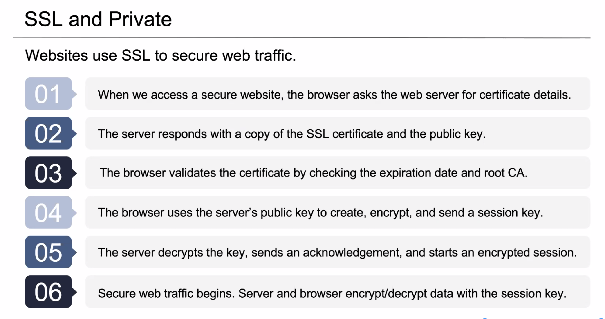

# Bootcamp PPT#28
## Session 10.3 Cryptography III
**Tuesday November 10, 2020** / 6:30-9:30 PM
**Zoom Link:** https://zoom.us/j/2246200754 
**Zoom Password:** 606132

### Expectations

- Apply Steganography.
- Use SSL certificates.
- Use cryptographic methods to crack a password.
- Use **Hashcat**.

### Applied Cryptography

- Disk Encryption
  - BitLocker (Windows)
  - FilveVault (MacOS)
- Email Encryption
  - S/MIME
  - PGP
- Website Encryption
  - Secure Socket Layer (SSL)
  - HTTP over SSL (HTTPS) 
  - Passwords stored as hashes.

- Digital Forensics
- **Steganography** with `steghide`:
  - The practice of concealing messages or information within other nonsecret text or data.
  - `steghide embed -cf <frontFile> -ef <embededFile>`
  - `steghide enc info`
  - `steghide info <fileName>`
  - `steghide extract -sf <targetFile>`
  - `xxd <targetFile>`

- **SSL Certificates**
  - X.509 Standard
  - Company documents.
  - Unique IP address.
  - Certificate Signing Request (CSR)
    - Public and Private keys
    - Asymmetric
    - Validation with chain of trust.
  - Root certificate authorities.
  - Intermediate ceritifact authorites.

### Cryptogrphic Attacks

- Statistical Attacks.
- Brute Force Attacks.
- Birthday Attack.
- Frequency Analysis.
- Replay Attack.
- Rainbow Tables .
  - Set of precomputed hashes with associated plaintext.
  - Mitigation agaisnt a rainbow table can be done with salts.

