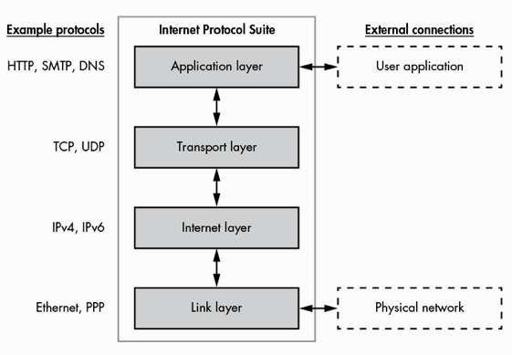
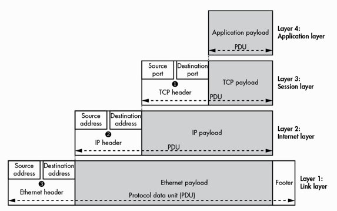

# Bootcamp PPT#22
## Session 8.2 Networking Fundamentals II
**Saturday October 24, 2020** / 6:30-9:30 PM
**Zoom Link:** https://zoom.us/j/2246200754 
**Zoom Password:** 606132

### Expectations

- Interpret network packets by analyzing their hearder, payload, and trailers.
- Understand the roles of network ports. 
- Associate common protocols with assigned ports.
- Understand the OSI model.
- Capturing packets with wireshark.

### Fundamentals

- Network Protocols

  - http
  - ftp
  - pap (authentication)
    - Two-way handshake
    - Accept / Reject
  - smb (windows)
  - netbios

- Clients and Servers exchange binary data.

- Network Packets

  - header (96 bits)
  - payload (660 bits)
  - trailer (32 bits)

- Common Ports

  - PORT 80 **HTTP**
  - PORT 443 **HTTPS**
  - PORT 21 **FTP**
  - PORT 22 **SSH**
  - PORT 25 **SMTP**
  - PORT 53 **DNS**

  

### OSI Model

| Type  | Layer               | Protocol Data Unit                                           | Function                                                     |
| ----- | ------------------- | ------------------------------------------------------------ | ------------------------------------------------------------ |
| Host  | **7** Application   | **User Data:** HTTP, FTP, IRC, SSH, DNS, SQL                 | High-level **APIs**, including resource sharing, remote file access |
| Host  | **6** Presentation  | **Syntax Data:** SSL, SSH, IMAP, FTP,MPEG, JPEG              | Translation of **data between a networking service and an application**; including character encoding, data **compression** and **encryption**/**decryption**. |
| Host  | **5** Session       | **Port Data:** APIs, Sockets, Winsock                        | Managing communication **sessions**, i.e., continuous exchange of information in the form of multiple back-and-forth **transmissions between two nodes**. |
| Host  | **4** Transport     | **End to End:** Segment, Datagram, TCP, UDP                  | Reliable **transmission of data segments** between points on a network, including **segmentation**, **acknowledgement** and **multiplexing**. |
| Media | **3** Network       | **Packet Data:** IPv4, IPv6, ICMP, IPSSec, IGMP              | Structuring and managing a multi-node network, including **addressing**, **routing** and **traffic control**. |
| Media | **2** Data Link     | **Frame Data:** Ethernet, PPP, Switch, Bridge, MAC           | Reliable transmission of **data frames** between two nodes connected by a physical layer. |
| Media | **1** Physical Link | **Physical Structure Data:** Bit, Symbol, Coax, Fiber, Wireless, Hubs, Repeaters | Transmission and reception of **raw bit streams** over a **physical medium**. |

### Wireshark

- Filter method examples:
  - `http.request.method=="GET"`
  - `http.request.method=="POST"`

